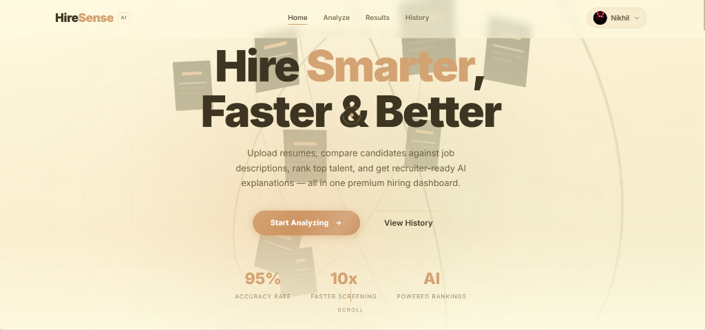
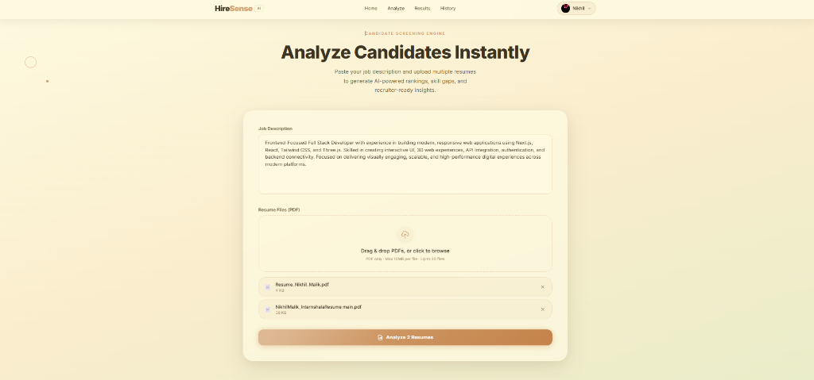
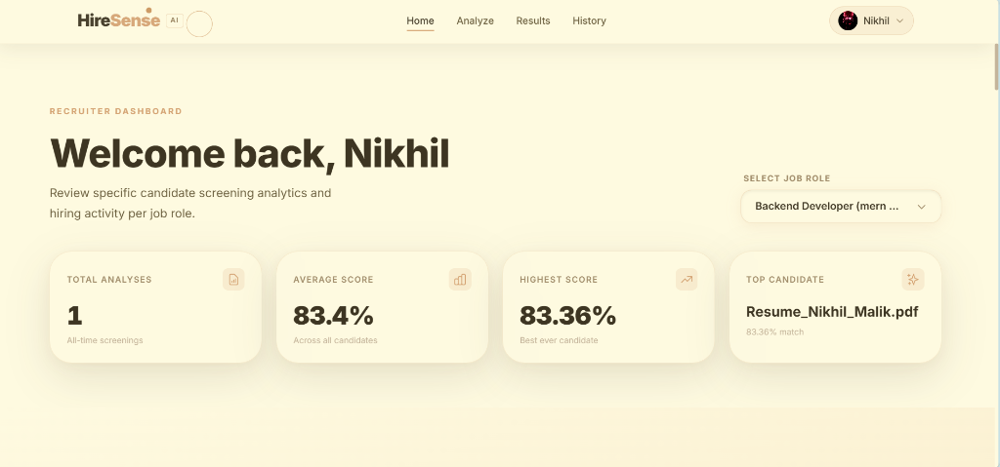
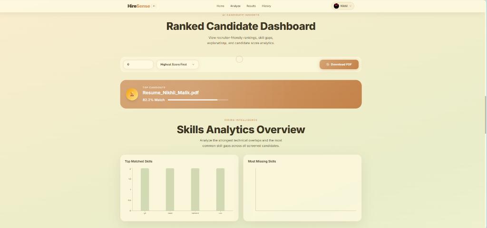
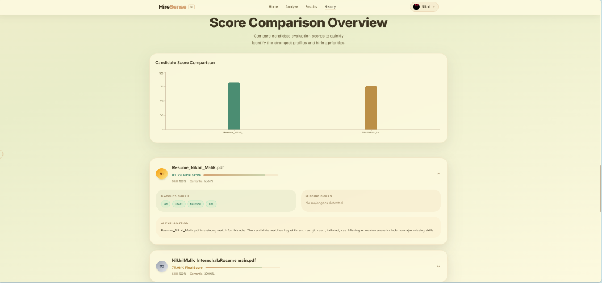
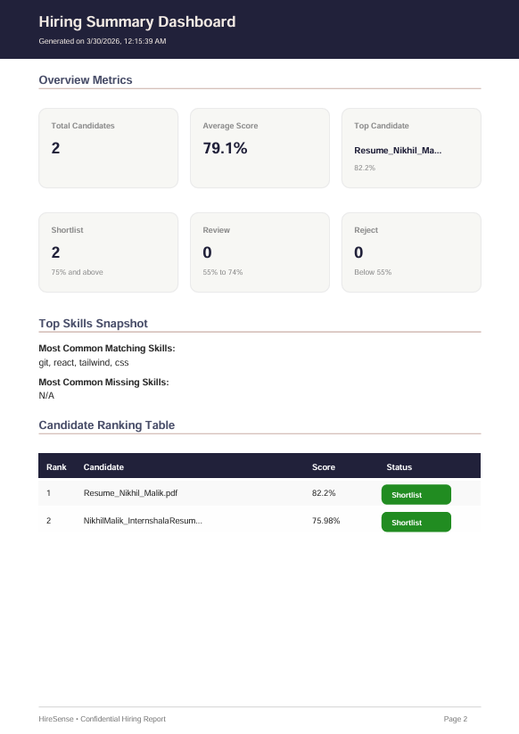
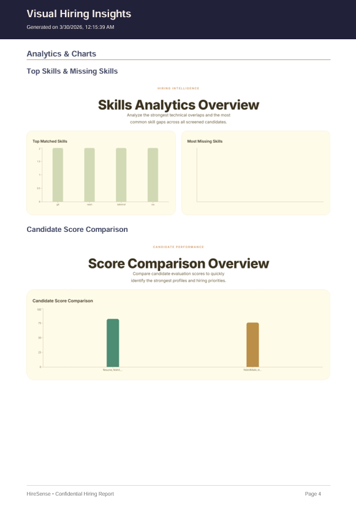

<p align="center">
  
</p>

<h1 align="center">HireSense — AI-Powered Resume Intelligence Platform</h1>

<p align="center">
  A production-grade full-stack application that analyzes, scores, and ranks resumes against job descriptions using advanced NLP and semantic similarity.
</p>

---

## Overview

HireSense is an AI-powered recruitment intelligence platform built to streamline resume screening and candidate evaluation. The application compares uploaded resumes against job descriptions using transformer-based Natural Language Processing, enabling context-aware candidate matching rather than relying solely on keyword overlap.

The platform is designed with a scalable microservices architecture, combining a modern frontend, a robust backend, and a dedicated NLP engine for high-performance text analysis. It provides recruiters and users with match scores, ranked candidate insights, visual analytics, and downloadable reports in a professional, intuitive interface.

---

## Screenshots

### Landing Page


### Resume Upload and Analysis Interface


### Recruiter Dashboard


### Ranked Candidates Dashboard


### Score Comparison Analytics


---

## Sample Generated Report

HireSense includes a professionally generated **AI Candidate Screening Report** that summarizes candidate rankings, semantic match scores, technical skill alignment, shortlist recommendations, and visual hiring insights.

This report demonstrates the platform’s ability to transform raw resume analysis into recruiter-friendly decision support documentation.

### Report Highlights
- Candidate ranking and shortlist recommendations
- Final match score and semantic similarity breakdown
- Matched and missing skills analysis
- Executive summary for hiring review
- Visual analytics including score comparison and skill trends

### Download / View Sample Report

[](./sample-hiring-report.pdf)

> If GitHub does not preview the PDF directly, click **Download** after opening it.

---

## Report Preview

### Hiring Dashboard Preview


### Visual Hiring Insights Preview


---

## Key Features

### Intelligent Resume Matching
- Compares resumes and job descriptions using semantic similarity instead of basic keyword matching
- Captures contextual relevance for more accurate candidate evaluation

### Transformer-Based NLP Engine
- Extracts and processes resume content using Python-based NLP pipelines
- Uses Sentence Transformers and PyTorch for contextual embedding generation

### Scalable Microservices Architecture
- Node.js and Express handle API orchestration, authentication, and application logic
- FastAPI powers the NLP microservice independently for better scalability and maintainability

### Interactive and Modern Frontend
- Built with React and Tailwind CSS for a clean, responsive experience
- Enhanced with Framer Motion animations and 3D visual elements using Three.js and React Three Fiber

### Visual Analytics and Candidate Insights
- Displays ranked candidate results with score-based comparisons
- Provides analytical charts for easier decision-making

### Professional Report Generation
- Generates downloadable PDF reports for candidate evaluations
- Useful for recruiters, hiring teams, and project demonstrations

### Secure User Authentication
- JWT-based authentication for protected user access
- Password hashing implemented using bcryptjs

### Persistent Data Storage
- Stores user data, resume history, and candidate results in MySQL
- Supports future scalability and historical performance tracking

---

## Technology Stack

| Layer | Technologies |
|------|-------------|
| Frontend | React, Tailwind CSS, Framer Motion |
| 3D Graphics | Three.js, React Three Fiber |
| Backend | Node.js, Express.js |
| NLP Service | Python, FastAPI, PyTorch, Sentence Transformers |
| Database | MySQL |
| Authentication | JWT, bcryptjs |
| File Handling | Multer, pdfminer.six |
| Visualization | Recharts |
| Reporting | jsPDF, html2canvas |

---

## Project Structure

```bash
HireSense/
├── frontend/                 # React frontend application
│   ├── src/
│   │   ├── components/       # UI components, charts, 3D visuals, upload forms
│   │   ├── pages/            # Home, Login, Register, Profile, Results
│   │   └── utils/            # Axios config and helper utilities
│   ├── package.json
│   └── vite.config.js
│
├── backend/                  # Node.js + Express backend
│   ├── config/               # Database and environment configurations
│   ├── controllers/          # Request handlers
│   ├── middleware/           # Authentication and error middleware
│   ├── routes/               # API routes
│   ├── server.js             # Backend entry point
│   └── package.json
│
├── nlp-service/              # Python FastAPI NLP microservice
│   ├── main.py               # API endpoints and NLP logic
│   └── requirements.txt      # Python dependencies
│
├── screenshots/              # Project screenshots used in README
├── report-images/            # Exported report preview images
├── sample-hiring-report.pdf  # Sample generated PDF report
└── start.bat                 # Optional startup script
```

---

## Installation and Setup

### Prerequisites

Before running the project, ensure the following are installed:

- Node.js v18 or later
- Python 3.9 or later
- MySQL Server

---

## Clone the Repository

```bash
git clone https://github.com/Nicode-x/HireSense.git
cd HireSense
```

---

## Install Dependencies

### Frontend
```bash
cd frontend
npm install
```

### Backend
```bash
cd ../backend
npm install
```

### NLP Service
```bash
cd ../nlp-service
pip install -r requirements.txt
```

---

## Environment Variables

Create a `.env` file inside the `backend` folder:

```env
PORT=5000
DB_HOST=localhost
DB_USER=root
DB_PASSWORD=your_mysql_password
DB_NAME=hiresense
JWT_SECRET=your_jwt_secret_key
NLP_SERVICE_URL=http://localhost:8000
```

> Important: Do not commit your `.env` file to GitHub.

---

## Running the Application

### Step 1 — Start the NLP Service
```bash
cd nlp-service
uvicorn main:app --reload --port 8000
```

### Step 2 — Start the Backend
```bash
cd backend
npm run dev
```

### Step 3 — Start the Frontend
```bash
cd frontend
npm run dev
```

---

## How It Works

The application follows a structured AI-powered workflow:

1. The user uploads a resume and enters a job description through the frontend
2. The backend receives the input and handles validation and routing
3. The backend forwards the request to the NLP microservice
4. The NLP service extracts text from the resume PDF
5. Sentence embeddings are generated using transformer models
6. Semantic similarity is calculated between resume content and job description
7. The final match score and insights are returned to the frontend
8. Results are visualized and optionally exported as PDF reports

This workflow ensures modularity, better maintainability, and strong performance for real-world deployment scenarios.

---

## Core Functional Highlights

- Resume-to-job-description semantic similarity scoring
- Candidate ranking system
- Resume analytics dashboard
- PDF resume parsing
- Match report generation
- User authentication and protected routes
- Persistent result history
- Clean and modern recruiter-friendly UI

---

## Possible Enhancements

Future improvements that can further elevate the platform include:

- Skill gap detection and missing keyword analysis
- Named Entity Recognition for extracting tools, skills, and qualifications
- Resume optimization suggestions
- Resume builder integration
- Admin panel for recruiters
- Dockerized deployment with `docker-compose`
- CI/CD integration for automated deployment
- Cloud deployment on AWS, Render, Railway, or Vercel

---

## Use Cases

HireSense can be extended or adapted for:

- Recruitment platforms
- Resume screening tools
- Applicant Tracking System prototypes
- Career guidance tools
- HR analytics dashboards
- AI-powered hiring assistants

---

## License

This project is licensed under the **ISC License**.

---

## Author

**Nikhil Malik**  
Full Stack Developer | AI/ML Enthusiast | Backend-Focused Builder

GitHub: [Nicode-x](https://github.com/Nicode-x)

---

## Project Demonstration

This repository includes:
- Full working frontend and backend source code
- NLP microservice integration
- Interactive analytics dashboard
- Resume scoring workflow
- Demonstration screenshots
- Sample hiring report PDF
- Project demo GIF

---

## Final Note

HireSense is not just a frontend showcase or academic prototype. It demonstrates practical full-stack engineering, applied NLP, API orchestration, structured data processing, analytics visualization, and recruiter-oriented product design in a single cohesive system.